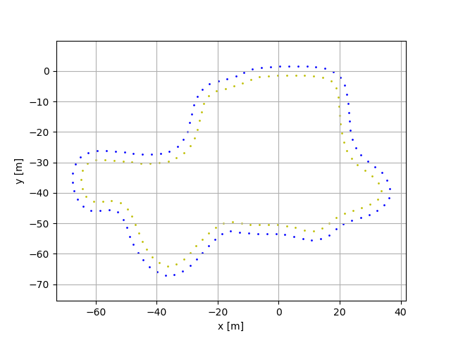

# Random Track Generator

Generate random tracks of different shapes and sizes that adhere to the Formula Student Rules for the Formula Student Driverless competitions. This script was developed by [Formula Student Team Delft](fsteamdelft.nl), used for an [FSSIM](https://github.com/AMZ-Driverless/fssim) based simulator.

## Description

The tracks are generated using a bounded Voronoi diagram, which is created from a uniformly sampled set of points. 

### Input parameters

* n_points: 
* n_regions:
* 

### Output parameters

## Credits

This method is based on Ian Hudson's [Race-Track-Generator](https://github.com/I-Hudson/Race-Track-Generator).