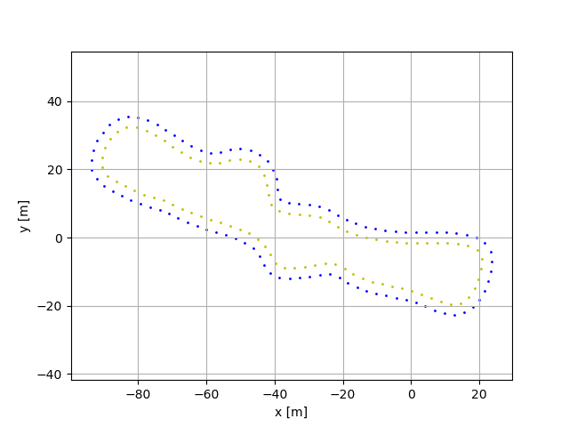
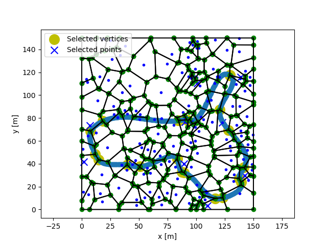

# Random Track Generator

<p float="middle">
  
   
</p>

Generate random tracks of different shapes and sizes that adhere to the Formula Student Rules for the Formula Student Driverless competitions. This script was developed by [Formula Student Team Delft](fsteamdelft.nl), used for an [FSSIM](https://github.com/AMZ-Driverless/fssim) based simulator.

## Description

The tracks are generated using a bounded Voronoi diagram, which is created from a uniformly sampled set of points. From this Voronoi diagram, regions are selected based on one of three selection modes. By interpolating the selected region's vertices using a cubic spline, a track is generated.

### Input parameters

* *n_points*: Number of points to generate a Voronoi diagram from.
* *n_regions*: Number of Voronoi regions (cells) to select.
* *min_bound*: Minimum x and y bound of Voronoi diagram.
* *max_bound*: Maximum x and y bound of Voronoi diagram.
* *mode*: Method used to select Voronoi regions.
    1. *Expand*: Find the n closest neighbours to the first randomly selected region.
    2. *Extend*: Select a region randomly. Draw a line with random orientation and find the closest n regions to this line.
    3. *Random*: Select n regions randomly.

### Track parameters

* *track_width*: Track width in meters.
* *cone_spacing*: Cone spacing in meters.
* *length_start_area*: Length of the start area in meters.
* *curvature_threshold*: Maximum curvature (minimum radius of curvature) threshold in 1/meters.
* *straight_threshold*: Minimum curvature threshold for the starting area in 1/meters.

### Output options

* *plot_track*: Plot the resulting track.
* *visualise_voronoi*: Visualise the Voronoi diagram and selected regions.
* *create_output_file*: Create yaml output track file.
* *output_location*: Location to output track file.

<p float="middle">
   
</p>

## Requirements

* python >= 3.7.8
* numpy >= 1.18.5
* scipy >= 1.4.1
* matplotlib >= 3.1.3
* shapely >= 1.7.1
* yaml >= 0.2.5

## Install

```bash
pip3 install -r requirements.txt
```

## Run

```python
python main.py
```

## Credits

This method is based on Ian Hudson's [Race-Track-Generator](https://github.com/I-Hudson/Race-Track-Generator).