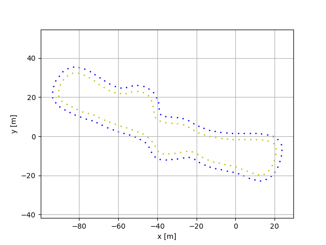
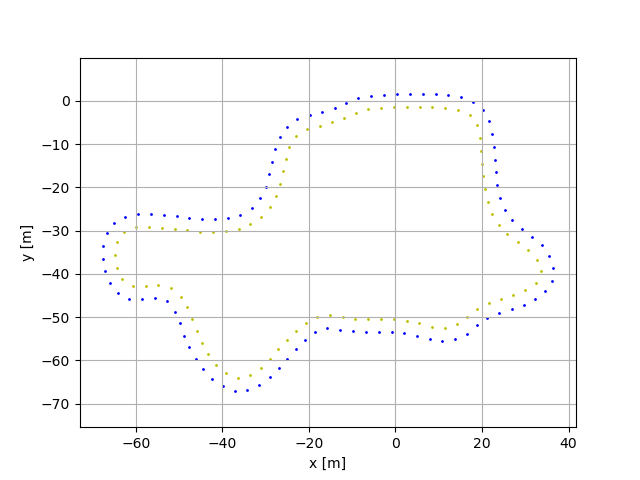
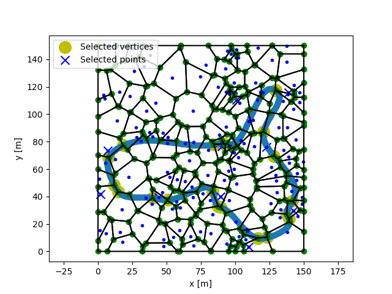

# Random Track Generator


<p float="middle">
  
  
</p>

Generate random, rules-compliant tracks for Formula Student Driverless competitions. Creates realistic tracks with proper track width, cone spacing, and corner radii using Voronoi diagram-based generation.

Developed by [Formula Student Team Delft](https://fsteamdelft.nl) for use with [FSSIM](https://github.com/AMZ-Driverless/fssim) and [FSDS](https://github.com/FS-Driverless/Formula-Student-Driverless-Simulator).

## How It Works

Tracks are generated using bounded Voronoi diagrams from uniformly sampled points. Regions are selected using one of three modes (**Expand**, **Extend**, or **Random**), then interpolated with cubic splines to create smooth, realistic racing lines.

<p float="middle">
  
</p>

## Installation

```bash
uv sync
```

## Usage

### Basic Example

```python
from track_generator import TrackGenerator
from utils import Mode, SimType

# Configure track generation
track_gen = TrackGenerator(
    n_points=60,           # Voronoi points
    n_regions=20,          # Regions to select
    min_bound=0.,          # Minimum x/y bound
    max_bound=150.,        # Maximum x/y bound
    mode=Mode.EXTEND,      # Selection mode
    plot_track=True,
    visualise_voronoi=True,
    create_output_file=True,
    output_location='/',
    sim_type=SimType.FSSIM
)

track_gen.create_track()
```

### Generation Modes

- **`Mode.EXPAND`** - Selects nearest neighbors for roundish tracks
- **`Mode.EXTEND`** - Selects regions along a random line for elongated tracks
- **`Mode.RANDOM`** - Randomly selects regions for large, irregular tracks

### Simulator Output

- **`SimType.FSSIM`** - Exports YAML format for FSSIM
- **`SimType.FSDS`** - Exports CSV format for FSDS
- **`SimType.GPX`** - Exports GPX format with lat/lon coordinates

### Quick Start

```bash
uv run python main.py
```

Edit parameters directly in `main.py` or use the `TrackGenerator` class in your own scripts.

## Configuration

All generation parameters can be configured through the `TrackGenerator` constructor. Key parameters include Voronoi diagram bounds, region selection count, track constraints (width, cone spacing, curvature), and output options.

> **Note:** Not all parameter combinations produce stable results. Experiment with settings if generation fails.

## Credits

Based on Ian Hudson's [Race-Track-Generator](https://github.com/I-Hudson/Race-Track-Generator).
